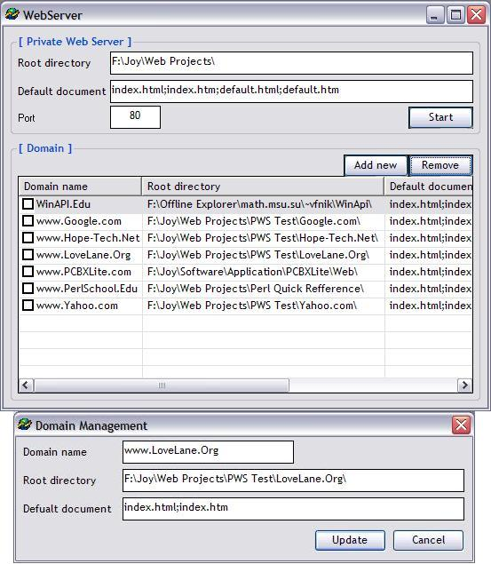



## WinSock \+ ADO \+ String \+ Logic = Web Server

### Description

Learn managing simultenous WinSock connections, ADO connectivity and Moduler coding with a sample Web Server project.

Simple web server supporting unlimited domains and redirections with default document!

I know there has been a lot web servers on PSC. Still I decided to make it up within 2 hours and submit for those who wants to learn WinSock handling, simple string manipulation, logic implementation & ADO connectivity. All these are done in moduler manner so code always remains reusable anyway!

This server can host unlimited number of domains with default document supprt. As these are being controlled with database backend, you can do anything like implementing bandwidth throttle like GeoCities or IIS, implementing site statistics like GeoCities, etc.

Only bug I was tired to fix up is that the server loses the relative path if the URL is not ended with a '/' or no document is specified. I mean 'http://YourServer/www.YourSite.com' would return the site but relative paths will be messed up. It is okay if you use 'http://YourServer/www.YourSite.com/' or 'http://YourServer/www.YourSite.com/Index.htm'.

Possible implementation could be many. I downloded the whole www.PHP.Net with Offline Navigator and hosted on my machine with this little server. I now just have to open my web browser to get help while I work on PHP! IIS or other hitech web servers would cost you more power, resource & management skill!

It doesn't support server side scripting.
 
### More Info
 

             |
---                |---
**Submitted On**   |2003-06-14 10:26:38
**By**             |[Broken Arrow](https://github.com/Planet-Source-Code/PSCIndex/blob/master/ByAuthor/broken-arrow.md)
**Level**          |Intermediate
**User Rating**    |5.0 (15 globes from 3 users)
**Compatibility**  |VB 5\.0, VB 6\.0
**Category**       |[Complete Applications](https://github.com/Planet-Source-Code/PSCIndex/blob/master/ByCategory/complete-applications__1-27.md)
**World**          |[Visual Basic](https://github.com/Planet-Source-Code/PSCIndex/blob/master/ByWorld/visual-basic.md)
**Archive File**   |[WinSock\_\+\_1612597102003\.zip](https://github.com/Planet-Source-Code/broken-arrow-winsock-ado-string-logic-web-server__1-46802/archive/master.zip)

